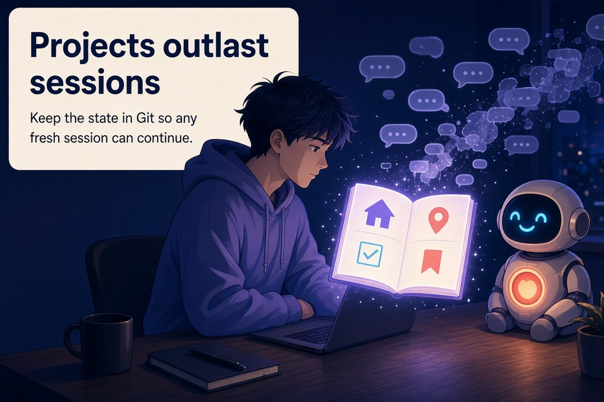
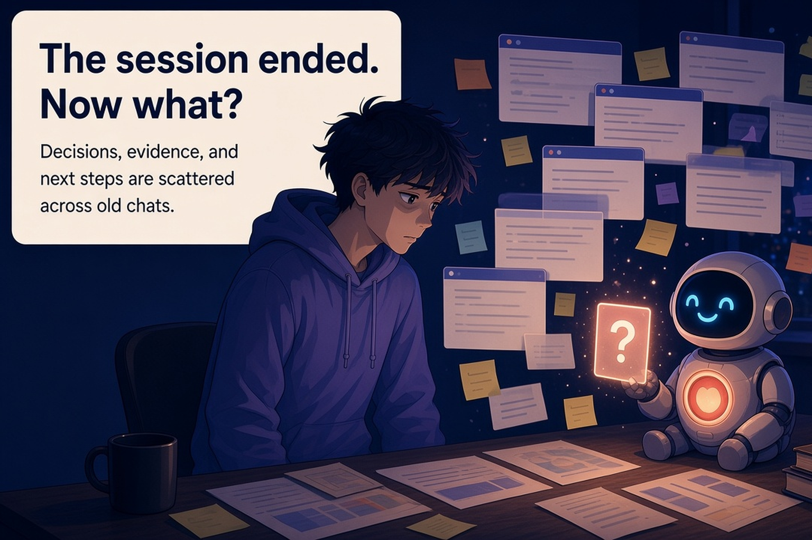
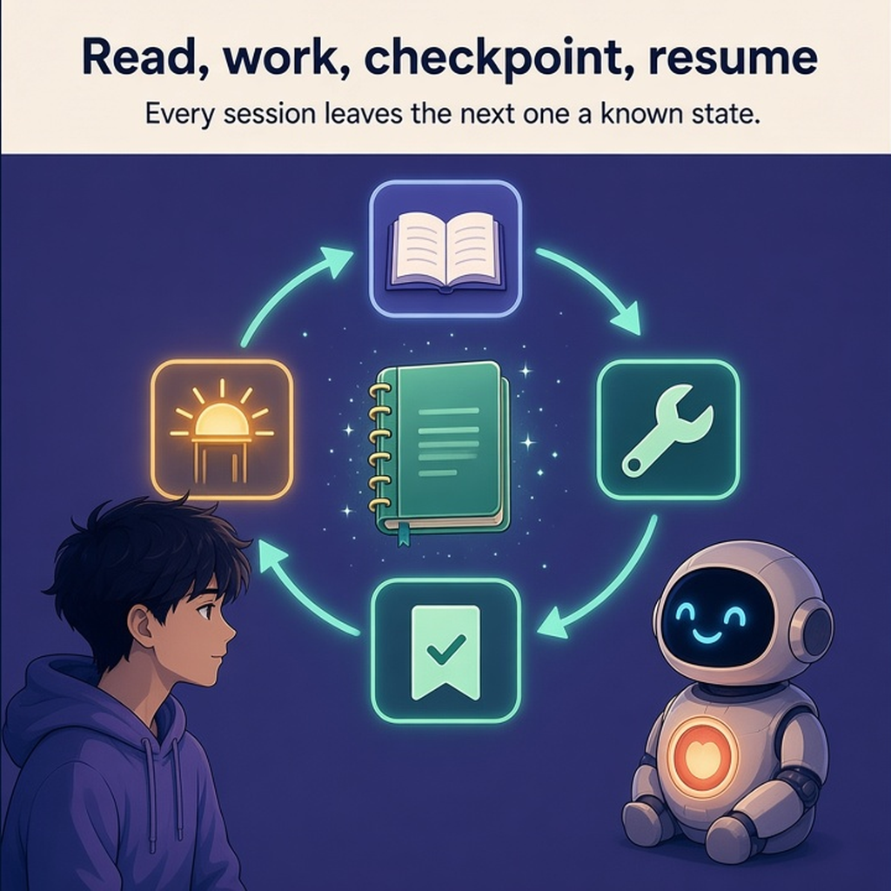

# Project Continuity Modules

> **Projects outlast agent sessions. Keep the project's state in the repository so any fresh session can pick up where the last one stopped.**

<p align="center">
  
</p>

Project Continuity Modules (PCM) is a protocol and a small Python CLI (`continuity`). Together they store a project's working memory as ordinary Markdown and JSON files in Git: what it is, where it stands, what task is active, and what the last session proved.

## Why this exists

**A project can last for months, but an agent session does not.** Context windows fill up. Chats end. Models change. A person comes back two weeks later. If the only record of "what we were doing" is the last conversation, the project stops making sense when that conversation is gone.

Here is how that goes wrong in practice. Suppose one session reports an evaluation score of 71.4% and a later session reports 74.2%. *(Illustrative numbers, not a PCM result.)* That comparison only means something if you can recover the conditions behind each number: the commit, the dataset revision, the model and prompt version, the commands that ran, and the failures that were excluded. When those details live only in chat history, the next session can compare incompatible runs, repeat an old mistake, or report a result nobody can reproduce.

<p align="center">
  
</p>

The same failure shows up in everyday work. Early decisions drop out of context. Summaries lose the detail that later matters. Agents redo work they cannot see. Every handoff turns into reconstructing history instead of continuing from a known state.

PCM does not make research or code correct. **It makes the state and evidence around the work durable enough to inspect, reproduce, and challenge later.**

## What this project is

**PCM is the toolkit and protocol. Your project repository owns its own state.** You install the CLI once. Then, inside each project you want to keep resumable, it creates and checks a small set of continuity files. You do not rely on PCM's own history to remember your project.

It is for people and agents who run long projects across many sessions: developers, researchers, and anyone who hands work between agent sessions, different models or tools, and colleagues.

PCM is **not**:

- a replacement for Git, or a hosted memory database;
- an autonomous project manager or polling agent;
- a substitute for tests or experimental rigor;
- a promise that anything an agent writes is true;
- a reason to keep every chat transcript.

## What you can make or use

- **A resumable project skeleton.** `continuity init` adds `PROJECT.md`, `HANDOFF.md`, `checkpoints/CURRENT.md`, `.continuity/config.json`, and versioned schemas. The `software` profile also adds `AGENTS.md` and a README.
- **Bounded task files.** Each unit of work gets its own `tasks/TASK-<PREFIX>-NNNN-*.md`, linked to its GitHub issue when the project uses GitHub.
- **Append-only checkpoints.** Each session records what it completed, the evidence, decisions, blockers, and one exact next action. A retry with the same request ID does not add a duplicate.
- **A validator.** `continuity validate` catches problems that are expensive to find later: a missing current-task file, a duplicated task ID, or a checkpoint without evidence.
- **Context packs.** A disposable bundle of the relevant files, stamped with Git provenance, for a fresh session.
- **An optional document catalog** (`continuity docs`), so a new session finds earlier work before it writes a duplicate.

## How it works

Each session follows the same short cycle:

<p align="center">
  
</p>

1. **Read the state.** A fresh session opens the repository, reads `HANDOFF.md` and `checkpoints/CURRENT.md`, and checks the live GitHub issue that owns the task.
2. **Do one bounded task.** It works only on that task, on that task's branch.
3. **Record the evidence.** Before stopping, it appends a checkpoint with what changed, which commands and tests ran, what is blocked, and the next action.
4. **Publish it.** It commits the work, then `continuity checkpoint` commits and pushes the checkpoint. The PR goes through required CI and GitHub auto-merge.
5. **Resume later.** The next session, in any tool or model, starts again from step 1. It does not need the old conversation.

**Who owns what** is spelled out so records do not compete. For GitHub projects, the GitHub issue owns task scope, priority, dependencies, and lifecycle. Every progress update names the leaf issue that owns the work and its parent. Merged history owns accepted code and documents. PR checks and merge records own delivery facts. The Markdown task and checkpoint files are versioned projections of that state, not a second source of truth. Context packs are derived and can be regenerated. See [SPEC section 8](SPEC.md#8-authority).

**Git is the transport** because it already provides durable versions, exact commits, branches for bounded work, reviewable diffs, and conflict detection. PCM builds on that instead of adding a separate memory service.

## Evidence and boundaries

**What is real today:** the protocol is `0.1.0-draft`, and the CLI package source is version `0.6.0` (raised by PCM-0057 so a stale install is visible: the receipt wire format changed under the old `0.5.0` label, and the checkpoint path now prints a version-drift NOTE), which **has not been published** to any package index. Building or testing the package does not publish it. The issue log format module is documented in [`docs/ISSUE_LOG_FORMAT.md`](docs/ISSUE_LOG_FORMAT.md): one plain-language shape for issue logs, updates and PRs that adopters can apply mechanically. Everything below was checked at commit [`d46e0b7`](https://github.com/Pukujan/project-continuity-modules/tree/d46e0b7d617d74504505326dcfdc3aa5b6b75220/), the merged result of the PCM-0054..0058 line of work on 2026-09-26.

| Claim | Status | What the evidence supports | What it does not establish | Source |
| --- | --- | --- | --- | --- |
| CLI package version is 0.6.0 | shipped (source only) | The package source declares `0.6.0` ([`__init__.py` L1](https://github.com/Pukujan/project-continuity-modules/blob/d46e0b7d617d74504505326dcfdc3aa5b6b75220/src/continuity/__init__.py#L1)); `continuity checkpoint` prints a NOTE when an installed binary's version differs from the checkout's | That a public release exists (PyPI returned 404 for `project-continuity` on 2026-09-24), or that the NOTE can force a reinstall — it warns, never blocks | [`src/continuity/__init__.py`](https://github.com/Pukujan/project-continuity-modules/blob/d46e0b7d617d74504505326dcfdc3aa5b6b75220/src/continuity/__init__.py#L1), [`docs/VERSIONING.md`](https://github.com/Pukujan/project-continuity-modules/blob/d46e0b7d617d74504505326dcfdc3aa5b6b75220/docs/VERSIONING.md), [#177](https://github.com/Pukujan/project-continuity-modules/issues/177) |
| issue-log-format module is 1.2.0 with diagram + readability rules | shipped (source only) | The module doc and generated guidance carry the 1.2.0 marker: mermaid diagram rules verified against GitHub rendering ([#126](https://github.com/Pukujan/project-continuity-modules/issues/126)) plus readability rules for tool-composed records — plain meaning before identifiers carry load, claim-first evidence, no bare acronyms on first use, one problem sentence leading openings ([#180](https://github.com/Pukujan/project-continuity-modules/issues/180), before/after exemplar [PR #178](https://github.com/Pukujan/project-continuity-modules/pull/178#issuecomment-5842450065)) | That a published release carries them; existing adopters still need the marker-replacement update path | [`docs/ISSUE_LOG_FORMAT.md`](docs/ISSUE_LOG_FORMAT.md), [`src/continuity/cli.py`](https://github.com/Pukujan/project-continuity-modules/blob/d46e0b7d617d74504505326dcfdc3aa5b6b75220/src/continuity/cli.py#L29) |
| Protocol version is 0.1.0-draft | shipped | The CLI and every profile declare this version | Stability. Draft versions may change | [`cli.py` L24](https://github.com/Pukujan/project-continuity-modules/blob/0b3be9ca80da816de4621ac4e85612990084216e/src/continuity/cli.py#L24), [`templates/v1/software/profile.json`](https://github.com/Pukujan/project-continuity-modules/blob/0b3be9ca80da816de4621ac4e85612990084216e/templates/v1/software/profile.json) |
| Two init profiles: `minimal` and `software` | shipped | `software` extends `minimal` with `AGENTS.md` and `README.md` | Fit for non-software projects beyond the minimal files | [`templates/v1/`](https://github.com/Pukujan/project-continuity-modules/blob/0b3be9ca80da816de4621ac4e85612990084216e/templates/v1), [`minimal/profile.json`](https://github.com/Pukujan/project-continuity-modules/blob/0b3be9ca80da816de4621ac4e85612990084216e/templates/v1/minimal/profile.json) |
| `init` is non-destructive | shipped | It refuses before writing if a planned path holds different content | Semantic merging of your existing docs. Use [`docs/TARGET_ADOPTION.md`](docs/TARGET_ADOPTION.md) for mature repositories | [`cli.py` L473](https://github.com/Pukujan/project-continuity-modules/blob/0b3be9ca80da816de4621ac4e85612990084216e/src/continuity/cli.py#L473) |
| Preflight distinguishes helper from target | shipped | Modes `TARGET_VALID`, `DEGRADED_TARGET`, `INVALID_TARGET`, `NOT_ADOPTED`, `HELPER_REPOSITORY` | That a target's content is correct, only that its shape is | [`cli.py` L1745–1781](https://github.com/Pukujan/project-continuity-modules/blob/0b3be9ca80da816de4621ac4e85612990084216e/src/continuity/cli.py#L1745-L1781) |
| Checkpoint retries are idempotent by request ID | shipped | Reusing an ID with the same payload does not duplicate. A changed payload is rejected | Exactly-once delivery across machines | [`tests/test_checkpoint_retries.py`](https://github.com/Pukujan/project-continuity-modules/blob/0b3be9ca80da816de4621ac4e85612990084216e/tests/test_checkpoint_retries.py) |
| Opt-in GitHub issue receipts | shipped (proven end-to-end in production) | After the wire-format fix at `8227885` ([#171](https://github.com/Pukujan/project-continuity-modules/issues/171)), `--receipt-repo`/`--receipt-issue` posted keyed leaf receipts on real checkpoint pushes repeatedly ([#175](https://github.com/Pukujan/project-continuity-modules/issues/175), [#177](https://github.com/Pukujan/project-continuity-modules/issues/177), [#180](https://github.com/Pukujan/project-continuity-modules/issues/180) each carry `pcm:receipt-v2` comments); a receipt-gap audit command was approved by owner decision on [#169](https://github.com/Pukujan/project-continuity-modules/issues/169) | That posting is default or atomic — it stays opt-in, one issue per checkpoint, not a lock; manual receipts remain valid | [#67](https://github.com/Pukujan/project-continuity-modules/issues/67), [#169](https://github.com/Pukujan/project-continuity-modules/issues/169), [`tests/test_receipt_json_encoding.py`](https://github.com/Pukujan/project-continuity-modules/blob/d46e0b7d617d74504505326dcfdc3aa5b6b75220/tests/test_receipt_json_encoding.py) |
| Automatic issue-comment synchronization | planned | Tracked as remaining publisher work | Any current implementation | [#67](https://github.com/Pukujan/project-continuity-modules/issues/67) |
| The test suite and self-validation pass | shipped | 264 deterministic tests; CI's six required contexts (quality, test 3.11/3.12, package, parity 3.11/3.12) are green on every merged PR through `d46e0b7`; `continuity validate` passes on this repo apart from one device-local worktree note | Behavior in untested environments, or that fresh agents follow the protocol unprompted — that is what the [#139](https://github.com/Pukujan/project-continuity-modules/issues/139) holdout measures; six local macOS-environmental fixture failures are documented in the task records | [`.github/workflows/ci.yml`](https://github.com/Pukujan/project-continuity-modules/blob/d46e0b7d617d74504505326dcfdc3aa5b6b75220/.github/workflows/ci.yml) |

**Boundaries that matter when you decide whether to use it:**

- Python 3.11+ is the only runtime requirement. The package has no runtime dependencies ([`pyproject.toml`](https://github.com/Pukujan/project-continuity-modules/blob/0b3be9ca80da816de4621ac4e85612990084216e/pyproject.toml)).
- GitHub is the only host with a tested CI/merge verifier for worktree cleanup. On other hosts PCM leaves worktrees in place.
- A citation or a checkpoint makes a claim traceable. It does not make it true.
- Deterministic tests cannot prove how a fresh agent behaves. [`docs/TESTING_POLICY.md`](docs/TESTING_POLICY.md) explains when a fresh-session blind test is needed, and [`docs/BLIND_TEST.md`](docs/BLIND_TEST.md) is one such protocol.

## Image generation and use

The three images in this README are new, generated narrative illustrations. They follow the [Content Generation Modules](https://github.com/Pukujan/content-generation-modules) image guide pinned at [`f85e88b`](https://github.com/Pukujan/content-generation-modules/blob/f85e88bc00362c53061d95ac7811bd9c6ada8e32/docs/IMAGE_GUIDE.md). PCM has no visual contract of its own, so they use that helper's default direction: anime-inspired editorial scenes, a recurring human and companion, blue-violet evening light, and warm accents. The characters are original to PCM (a developer and a lantern-shaped companion robot) and depict no real people.

| File | Role | Size | Placement |
| --- | --- | --- | --- |
| [`pcm-hero-continuity.png`](docs/content-system-assets/pcm-hero-continuity.png) | hero | 1536×1024 | below the title |
| [`pcm-problem-lost-context.png`](docs/content-system-assets/pcm-problem-lost-context.png) | problem | 1536×1024 | in "Why this exists" |
| [`pcm-cycle-square.png`](docs/content-system-assets/pcm-cycle-square.png) | supporting (system) | 1024×1024 | in "How it works", shown at 520px |

Exact title and subtitle copy, prompts, alt text, crop rules, rejection conditions, review decisions, and SHA-256 hashes are recorded in [`docs/content-system-assets/IMAGE_NOTES.md`](docs/content-system-assets/IMAGE_NOTES.md). To replace an image, regenerate it from that record, keep the same role and size, and update its hash.

## Templates and guides

**Start here if you want to go deeper:**

- [`SPEC.md`](SPEC.md): the normative protocol, record authority, and publication rules.
- [`docs/HANDOFF_PROTOCOL.md`](docs/HANDOFF_PROTOCOL.md): start-session and stop-session procedures, checkpoint format, degraded continuity, and context packs.
- [`docs/TARGET_ADOPTION.md`](docs/TARGET_ADOPTION.md): adding PCM to an existing repository without overwriting its own docs.
- [`AGENTS.md`](AGENTS.md): the full agent operating contract, including worktrees, workspace registry, receipts, and the document catalog.
- [`docs/VERSIONING.md`](docs/VERSIONING.md): protocol and package version rules and migration.
- [`docs/CONTINUITY_RECORDS_POLICY.md`](docs/CONTINUITY_RECORDS_POLICY.md): how to write issues and records a human can follow.
- [`docs/AGENT_LIFECYCLE.md`](docs/AGENT_LIFECYCLE.md): closing delegated agents after they return.
- [`templates/v1/`](templates/v1): the files each profile installs. [`schemas/v1/`](schemas/v1): the machine-readable contracts.
- [`docs/CONTINUITY_INDEX.md`](docs/CONTINUITY_INDEX.md): the generated catalog of this repository's own records.

## Prior work and references

- **This repository dogfoods itself.** PCM's own tasks, checkpoints, and handoffs live in [`tasks/`](tasks), [`checkpoints/CURRENT.md`](checkpoints/CURRENT.md), and [`HANDOFF.md`](HANDOFF.md). The first external dogfood run is in [`examples/minimal-dogfood/`](examples/minimal-dogfood/README.md).
- **Earlier README story.** The problem-first narrative, covering session dependence, context rot, and research reproducibility, comes from the previous version of this README. Content Generation Modules later cited it as a reference pattern in its [reverse analysis](https://github.com/Pukujan/content-generation-modules/blob/f85e88bc00362c53061d95ac7811bd9c6ada8e32/docs/REVERSE_ANALYSIS_PCM_AND_ADOPTERS.md). This rewrite keeps that story and moves the operational detail into the linked docs.
- **Structure and images** follow the Content Generation Modules README contract ([`readme-contract.json`](https://github.com/Pukujan/content-generation-modules/blob/f85e88bc00362c53061d95ac7811bd9c6ada8e32/templates/readme-contract.json), [playbook](https://github.com/Pukujan/content-generation-modules/blob/f85e88bc00362c53061d95ac7811bd9c6ada8e32/docs/README_PLAYBOOK.md)), pinned at `f85e88b`.
- **Git worktrees** are used as documented in [Git's worktree reference](https://git-scm.com/docs/git-worktree). Issue linking follows [GitHub's issue-linking rules](https://docs.github.com/en/issues/tracking-your-work-with-issues/using-issues/linking-a-pull-request-to-an-issue).

## Try it

**The smallest useful path: install from source, initialize a project, and validate it.** No package has been published, so install from a checkout:

```bash
git clone https://github.com/Pukujan/project-continuity-modules.git
cd project-continuity-modules
python -m pip install -e .
continuity --version        # continuity 0.5.0
```

Then, inside the Git repository you want to make resumable:

```bash
continuity init --profile software --name "My Project" --task-prefix APP
continuity validate                 # VALID
continuity preflight --root .       # MODE: TARGET_VALID
```

`init` lists every file it creates and refuses to overwrite different existing content. For a repository that already has its own `PROJECT.md`, `AGENTS.md`, or `HANDOFF.md`, follow [`docs/TARGET_ADOPTION.md`](docs/TARGET_ADOPTION.md) instead.

**Next steps in a real project:**

```bash
continuity task new --slug first-task \
  --goal "Implement the first bounded piece of work." \
  --why "This is the next dependency in the project." \
  --issue https://github.com/OWNER/REPO/issues/123   # required when GitHub tracking is on

continuity checkpoint APP-0001 --agent "your-name" \
  --completed "Implemented the bounded change." \
  --evidence "pytest -q -> 42 passed" \
  --next "Open the review PR and verify CI."
```

`checkpoint` commits and pushes, so run it on a task branch with a remote. The full flags for recovery receipts, worktrees, the document catalog, and opt-in issue receipts are in `continuity <command> --help` and [`AGENTS.md`](AGENTS.md).

**Developing PCM itself:**

```bash
PYTHONPATH=src python -m unittest discover -s tests -v
PYTHONPATH=src python -m continuity validate --root .
```

The long-term test is simple: **a project should remain understandable and resumable even if every previous agent session disappears.**
