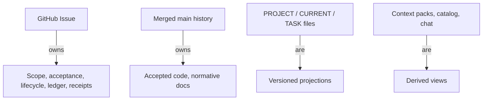
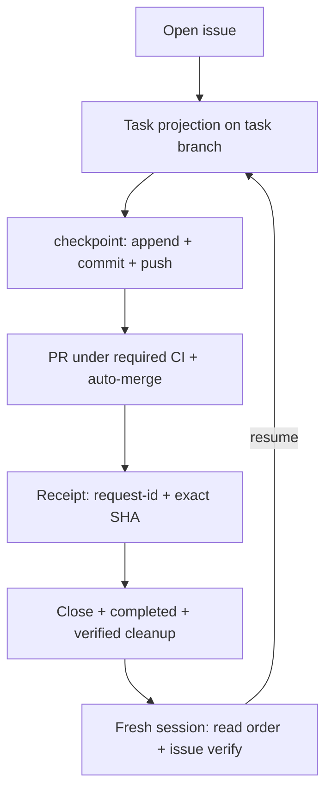
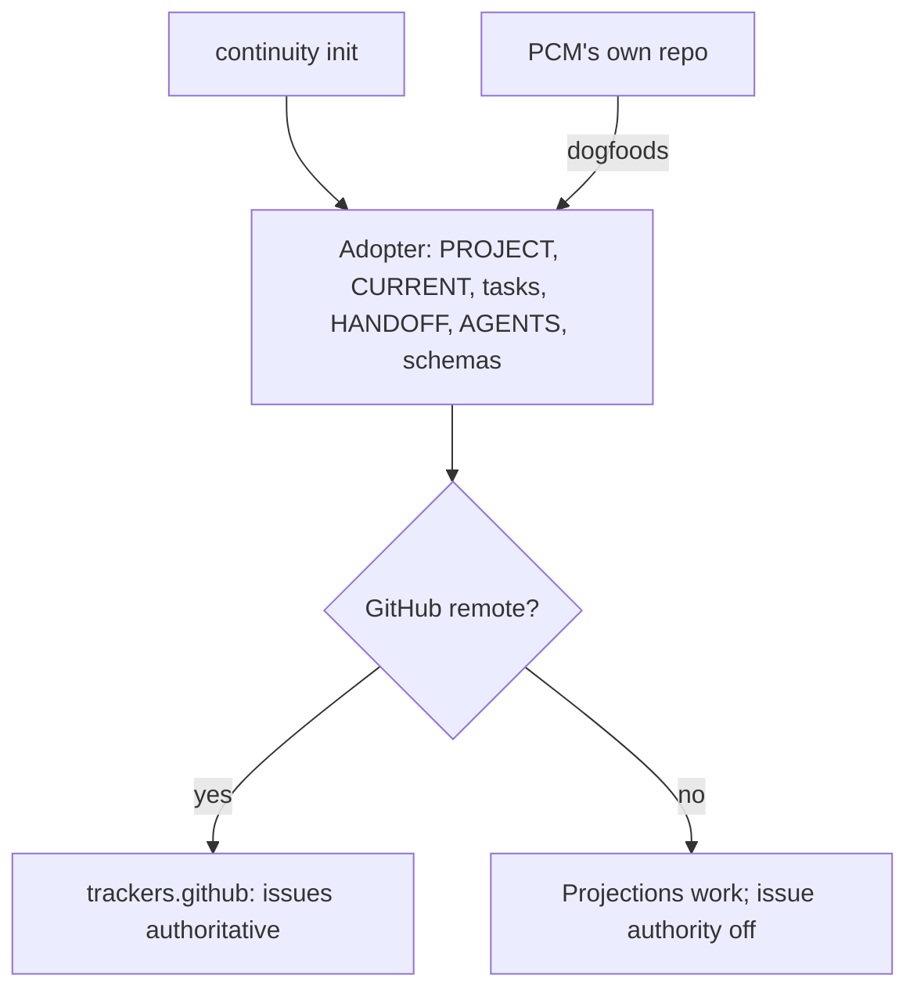
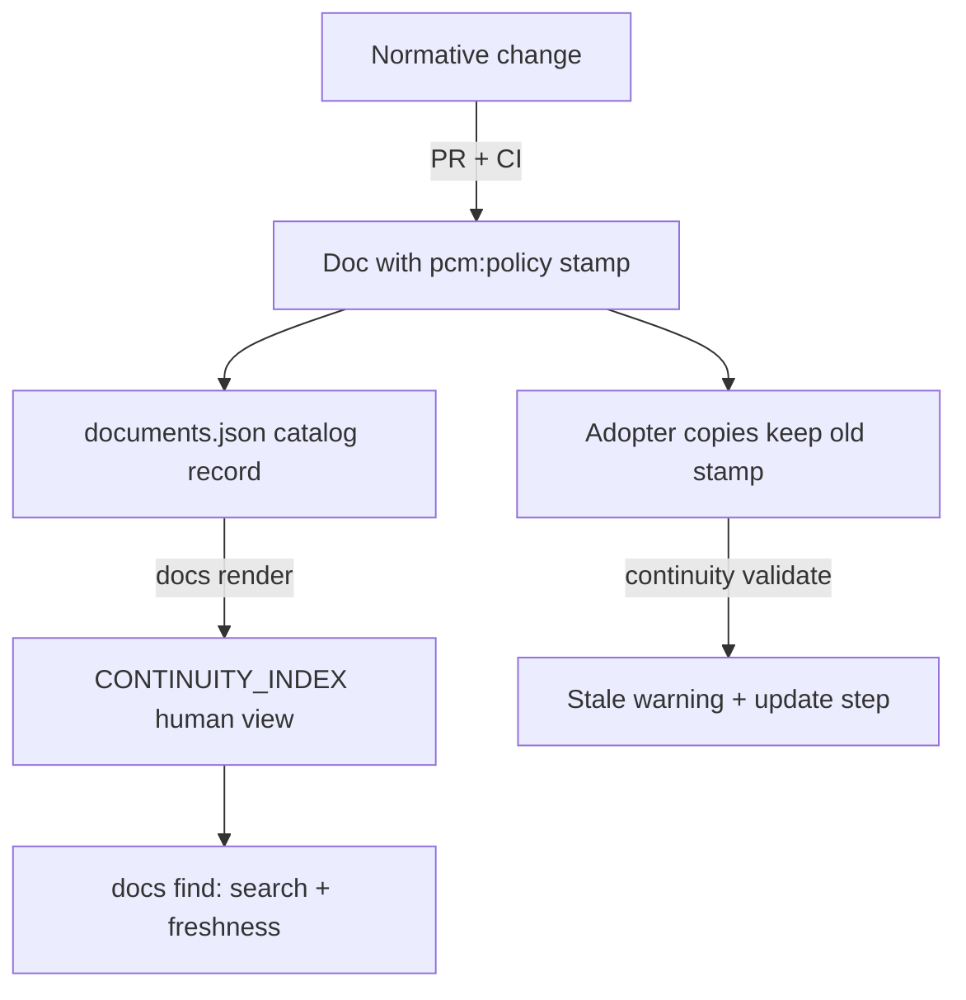

# PCM architecture — how the system actually works

<!-- pcm:policy {"id":"architecture-guide","policy_version":"1.0.0","protocol_version":"0.1.0-draft"} -->

This document is the human-readable explanation of how Project Continuity Modules works: who owns what, what a checkpoint is, how a session resumes, and how PCM-for-itself differs from PCM-for-adopters. It mirrors the normative rules ([SPEC.md](../SPEC.md) §2, §5, §8 — authority, session lifecycle, bounded authority) in plain language; where wording differs, SPEC is normative. Provenance: the answer recorded in issue [#128](https://github.com/Pukujan/project-continuity-modules/issues/128), promoted by [#134](https://github.com/Pukujan/project-continuity-modules/issues/134); diagrams follow the [`issue-log-format` 1.2.0](ISSUE_LOG_FORMAT.md) rules.

## The ownership model

**GitHub Issues own task state** — scope, acceptance, priority, ownership, dependencies, lifecycle, and the progress ledger: every update links leaf/parent/dependency lineage, and receipts record the checkpoint request ID plus the exact pushed SHA. **Merged `main` history owns accepted code and normative/domain documents.** The checked-in files are **mandatory versioned projections**, never parallel authority:

| File | Role |
| --- | --- |
| `PROJECT.md` | stable purpose, main goal, scope, principles, definition of success |
| `checkpoints/CURRENT.md` | program-wide present state, the active task pointer, next atomic action |
| `tasks/TASK-<ID>-*.md` | one bounded unit of work: acceptance, evidence, append-only checkpoint log, handoff |
| `HANDOFF.md` / `AGENTS.md` | cold-start read order for humans / the agent operating contract |
| `.continuity/config.json` | repository manifest: profile, task prefix, canonical paths, `trackers.github` authority switch, workspace mode, protocol version |
| `.continuity/documents.json` → `docs/CONTINUITY_INDEX.md` | machine-readable document catalog → generated human view |

Context packs, the catalog, the index, and chat are **derived views** — `continuity pack` output is convenience, never canonical.

Diagram: who owns what (vertical; expand to inspect)

Text alternative: 1) the GitHub issue owns scope/acceptance/lifecycle/progress/receipts; 2) merged `main` owns accepted code and normative docs; 3) PROJECT/CURRENT/TASK files are versioned projections of the issue; 4) context packs, the catalog, and chat are derived views, never canonical.

## What a checkpoint is, and where it lives

`continuity checkpoint <TASK-ID> --agent … --completed … --evidence … --next …` appends an **immutable event to the task file** (a `### timestamp — writer` section plus a `continuity:checkpoint` JSON marker with a stable `--request-id` for safe retries), commits it, and **synchronously pushes the task branch**. Checkpointing is therefore tracked per task; the task file is bound to its issue via `issue_url`; delivery is complete only after PR + required CI + auto-merge + the receipt comment. Local commits are never "delivered".

## How a session resumes

A fresh session reads `PROJECT.md` → `checkpoints/CURRENT.md` → the active task CURRENT names → the minimum relevant spec, runs `continuity issue verify <TASK-ID>` against the live issue, and consults `continuity docs find "<terms>" --task <ID>` before deciding prior work is missing. No prior chat is required — that is the definition of success in `PROJECT.md`.

Diagram: one task's lifecycle (vertical; expand to inspect)

Text alternative: open issue → task projection on its branch → `continuity checkpoint` (append event, commit, push) → PR with required checks and auto-merge → leaf/parent receipts keyed to the pushed SHA → close, mark completed, verified worktree cleanup → any fresh session resumes from the read order after `continuity issue verify`.

## What a TASK is

One bounded unit of work with **one primary writer at a time**, identified by its task ID (PCM uses `PCM-XXXX`): GitHub issue (authority) + task file (projection + append-only checkpoint log + handoff) + task branch (`task/<ID>-…`) + optionally one managed worktree (`pcm/worktree/<ID>`). Acceptance criteria, evidence, blockers, and the single next action live in that pairing.

## PCM for itself vs PCM for adopters

PCM **dogfoods its own protocol** — this repository is governed by the same issues, projections, checkpoints, and CI gates described above. An **adopting repository** runs `continuity init` and receives the identical layout (root files, schemas, optional `.github` templates); `trackers.github` (auto-true for GitHub remotes) switches on issue authority, and [TARGET_ADOPTION.md](TARGET_ADOPTION.md) protects a mature repository's own domain documents — adoption layers continuity on top, it does not replace the target's contracts.

Diagram: same protocol, two homes (vertical; expand to inspect)

Text alternative: `continuity init` gives every adopter the same file layout; GitHub remotes enable issue authority automatically; non-GitHub projects keep the projections without the issue layer; PCM's own repository uses the identical machinery.

## How the doc system works

Two ledgers that never overwrite each other: the **progress ledger** is the GitHub issue itself (living comments, append-only, receipts keyed to pushed SHAs — authority over task state); the **knowledge ledger** is the repository's docs, owned by merged `main` and changed only through PR + review + CI.

Version tracking has three independent classes ([SPEC §7](../SPEC.md), [VERSIONING.md](VERSIONING.md)):

1. **Protocol** — `protocol_version` in `.continuity/config.json`: the shape of required core objects (project/current/task/checkpoint). Minor = backward-compatible additions; major = incompatible; migrations preserve historical checkpoint evidence.
2. **CLI/package** — `__version__` in `src/continuity/__init__.py`: the tool's own release line (currently 0.6.0, source only, unpublished).
3. **Policy modules** — `<!-- pcm:policy {"id":…,"policy_version":…} -->` stamps inside guidance text (e.g. `continuity-records` 1.3.0, `issue-log-format` 1.2.0, this guide 1.0.0). Adopters carry copies; `continuity validate` scans the copies present and warns on stale markers, printing the exact update step (replace the block between the start/end markers). A doc's version lives inside the doc, per copy, and drift is machine-detectable.

Discovery: `.continuity/documents.json` is the machine-readable inventory (id/title/summary/keywords/path/related/tasks/reviewed hashes); `continuity docs add/find/refresh/render` maintain it; `docs/CONTINUITY_INDEX.md` is the generated human view (`validate` fails on drift); `continuity docs find "<terms>" --task <ID>` answers with freshness states CURRENT / NEEDS_REVIEW / REMOTE_UNKNOWN.

Human doc vs agent doc: deliberately the same files — human-readable is a core principle — but each has a designated entry point: `README.md` (human pitch), `AGENTS.md` (agent contract, harness-injected), `HANDOFF.md` (cold-start read order), `SPEC.md`/`docs/*` (normative for both), catalog → index (machine data → human mirror).

Diagram: how a doc change reaches its readers (vertical; expand to inspect)

Text alternative: 1) a normative change lands as a PR on `main`, bumping the doc's `pcm:policy` stamp; 2) the catalog record and generated index follow, validated for drift; 3) adopters holding older copies get a stale warning with the exact marker-replacement step; 4) readers discover docs through the index, agents through `continuity docs find`; 5) [#100 / PCM-0028](https://github.com/Pukujan/project-continuity-modules/issues/100) will turn these stamps into a module registry with `continuity upgrade` (plan/diff/apply).

## Known gaps

- This guide lives in PCM's repository; adopters do not yet receive a protocol guide via `init` — distribution decision tracked on [#135](https://github.com/Pukujan/project-continuity-modules/issues/135).
- Root-file layout (why `AGENTS.md`/`HANDOFF.md` stay at root): analysis in [#127](https://github.com/Pukujan/project-continuity-modules/issues/127).

## Changelog

- **1.0.0 (2026-09-25):** initial architecture guide. Provenance: [#128](https://github.com/Pukujan/project-continuity-modules/issues/128) answer promoted by [#134](https://github.com/Pukujan/project-continuity-modules/issues/134); diagrams per `issue-log-format` 1.1.0 ([#126](https://github.com/Pukujan/project-continuity-modules/issues/126)).
