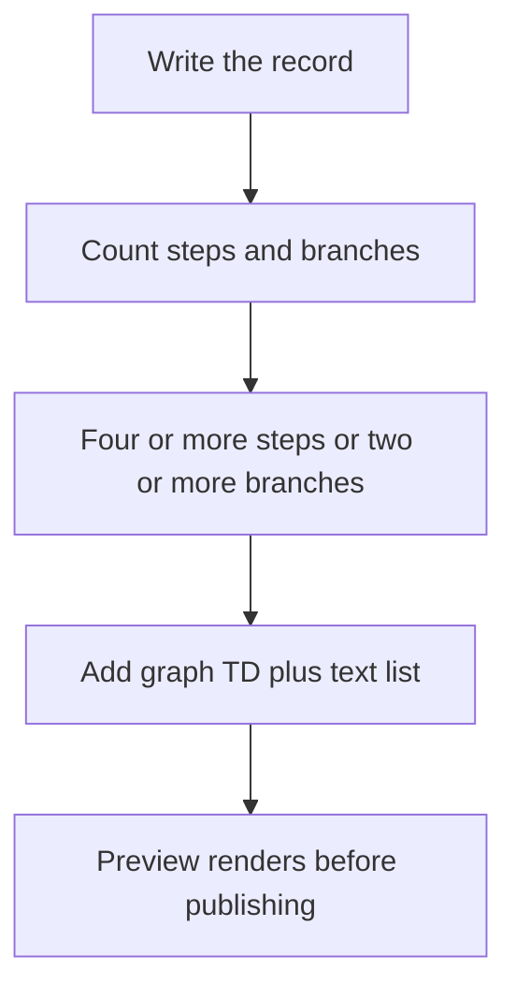

# Issue log format

One plain-language shape for issue logs, progress updates and pull requests that any PCM adopter can apply mechanically. The continuity-records policy states the record contract; this module states the readable structure a writer applies to fill it. Pick the tier by the kind of issue, not by preference.

<!-- pcm:policy {"id":"issue-log-format","policy_version":"1.2.0","protocol_version":"0.1.0-draft"} -->

<!-- pcm:issue-log-format:start -->
## Issue log format (issue-log-format 1.2.0)

<!-- pcm:policy {"id":"issue-log-format","policy_version":"1.2.0","protocol_version":"0.1.0-draft"} -->

Write issue logs, progress updates, and pull requests in one plain-language shape a newcomer can follow. Pick the tier by the kind of issue, not by preference. **Core tier (every issue log):** title states the problem and intended direction; a 1-3 paragraph summary naming who/what is affected, the consequence, and what this proposes; identity and lineage (leaf owning issue, parent ancestry or none, task ID, primary writer, branch); observed facts vs interpretation, with inferences labelled *inferred*; acceptance criteria with numeric thresholds marked *(proposed)* when untested; boundaries/non-goals and one next action. **Investigation tier (incidents, failures, research, design issues):** numbered symptoms; hypotheses with Status, confirm/refute, and experiment; evidence with provenance; a **Counter-signal** entry when one exists; honest caveat; problems-vs-gaps; a **Proposal** labelled *(proposal)* stating none of it exists unless named as existing. **Pull requests open reader-first:** problem and consequence, what changes, how to verify, and what stays unchanged; lineage links; evidence and one next action; long logs collapsed or linked; reference issues with "Refs #<number>" and use closing keywords only when closing at merge is intended. **Diagrams (mermaid):** when a record describes a flow with 4+ ordered steps or 2+ branches, add a fenced mermaid diagram *and* keep an adjacent text list or table so the record survives render failure; default to `graph TD` (vertical) because wide `LR` flows shrink to illegible strips on phones — reserve `LR` for 4 or fewer short nodes; cap 8 nodes and 6-word labels; wrap diagrams that may exceed the container width inside `<details>` (GitHub mounts the renderer lazily on expand); preview the rendered diagram before publishing (broken syntax shows a visible parse error) and never cite renderer URLs as standalone sources. No private absolute paths or secrets; link rather than paste long logs. See `docs/ISSUE_LOG_FORMAT.md` for the full format, exemplar, and examples.
<!-- pcm:issue-log-format:end -->

## Core tier (every issue log)

Use the core tier for every issue log, including trivial changes; it is short by design and adds no paperwork bundle.

1. **Title:** the problem and the intended direction, in plain words.
2. **Summary:** one to three short paragraphs a newcomer can follow. Cover what is affected and the consequence, where the problem does and does not happen when that contrast is known, and what the issue proposes. Define acronyms on first use. When an explanation is unproven, include one bolded sentence saying so.
3. **Identity and lineage:** leaf owning issue, parent ancestry (or explicitly none), dependencies (or none), task ID, branch, and primary writer. This restates the github-progression requirement without change.
4. **Observed facts vs interpretation:** label observed results, agent reports, and inferences separately. Mark a causal link that was inferred as *inferred*.
5. **Acceptance / success criteria:** observable checks. Use numeric thresholds where a measurement is involved, and mark untested thresholds *(proposed)*.
6. **Boundaries / non-goals** and **one next action**.

## Investigation tier (incidents, failures, research, design issues)

Add this tier when the issue concerns an incident, failure, research question, or design whose cause is not yet proven.

7. **Symptoms:** a numbered list with a bold short name and one observable sentence per item.
8. **Hypotheses (unverified):** each hypothesis carries an ID, a **Status** (unverified / confirmed / refuted / inconclusive), **Would confirm**, **Would refute**, and **Experiment**. A shared experiment matrix is optional.
9. **Evidence with provenance:** source type, time with a timezone label, and redacted identifiers. Each item says which hypothesis it supports or undercuts. Include a **Counter-signal** entry when one exists. Failures unrelated to the issue are named and routed elsewhere.
10. **Honest caveat:** legitimate outcomes that must not count as failures, and what the issue is **not** trying to do.
11. **Problems vs gaps:** problems as reported (and by whom), kept separate from gaps (capabilities we lack).
12. **Proposal (marked "proposal"):** every component is labelled *(proposal)*, and the section says: "None of it exists unless named as existing." Anything named as existing gives its repository path or link.
13. **Plan:** verification before build, and small separately verified increments.

## Writing rules (both tiers)

Plain language first, technical names after. Use bold only for the key uncertainty or decision, not for decoration. Give exact numbers, times with a zone, and no private absolute paths or secrets. Don't use issue-closing keywords in progress text. Link rather than paste long logs.

## Readability rules

Records the tools compose — pull-request bodies, checkpoint entries, `CURRENT.md` projections — follow the same newcomer standard as issue logs:

- Give every SHA, comment id, flag name, file path, or tool name a plain-word meaning in the same sentence before it carries load. A reader who has never seen `--allow-stale-base`, `ISC003`, or a comment number must still be able to follow the sentence around it.
- Write evidence as **claim first, numbers as support**: "nothing this change could break failed (263 tests, same six machine-environment failures as before)", never bare "259 = six known, 3F+1E".
- No unexplained acronym or bare identifier on first use, in any tier. Explain once, then use freely.
- PR openings and checkpoint `Completed:`/`Next:` lines start with one problem sentence a newcomer can follow; details follow below it.
- The rule set applies to CURRENT projections and checkpoint entries exactly as to issue logs — cold-start sessions read those first.

## Diagrams (mermaid)

Fenced `mermaid` blocks render natively on GitHub in issue bodies, issue comments, PR bodies, PR comments, and repository file views. These rules keep a rendered diagram readable on desktop and on a phone. Verified 2026-09-25 against GitHub's renderer (a viewscreen iframe; a ` ```mermaid info ``` ` probe reports `v11.17.2`) in the disposable matrix [`Pukujan/pcm-mermaid-matrix`](https://github.com/Pukujan/pcm-mermaid-matrix): [issue #1 probes](https://github.com/Pukujan/pcm-mermaid-matrix/issues/1), [PR #2 surfaces](https://github.com/Pukujan/pcm-mermaid-matrix/pull/2), [file view](https://github.com/Pukujan/pcm-mermaid-matrix/blob/main/MERMAID_MATRIX.md).

1. **Draw when multi-step.** A flow, state machine, decision tree, or pipeline with 4 or more ordered steps or 2 or more branches gets a diagram *in addition to* the text. Reason: prose is weakest exactly where a picture carries the shape.
2. **Text alternative mandatory.** The adjacent step list or table stays in the record beside the diagram. Reason: the record must survive render failure, API-only readers, and search.
3. **Vertical by default.** `graph TD` is the required direction. Reason: a 7-node `flowchart LR` measured 2120px wide inside an 878px container; GitHub scales it to fit, so on a 390px phone it becomes an illegible strip, while the same content as `graph TD` renders 441px wide and stays readable at both widths.
4. **`LR` only for tiny graphs.** Reserve `LR` for at most 4 short-label nodes. Reason: a horizontal flow only stays legible while the whole graph fits near the container width.
5. **Size caps.** At most 8 nodes and labels of at most 6 words (at most 2 lines per label). Reason: oversized nodes and labels are what push a diagram past the readable width.
6. **Wide diagrams collapsed.** Anything that might exceed the container width goes inside `<details>` with a summary that names the diagram. Reason: mobile readers keep the text and desktop readers expand to inspect; GitHub mounts the renderer lazily, only after the reader expands, so the cost is paid on use.
7. **Verify before publishing; never link the renderer.** The author must see the diagram render — preview it before publishing; broken syntax shows a visible "Syntax error in text" panel and the reader silently loses the information. Note the renderer version an info probe reports when you verify. Cite the markdown source location instead of renderer (viewscreen) URLs. Reason: a standalone viewscreen URL is an empty shell without the parent page's posted data, so a diagram cannot be deep-linked.

Good — small vertical graph, readable at desktop and phone width (this document renders it), with the mandatory text list beside it:



Text alternative: 1) write the record; 2) count steps and branches; 3) with 4+ steps or 2+ branches, add a `graph TD` diagram beside the text list; 4) preview the render before publishing.

Bad — a 7-node horizontal flow, described here rather than rendered so this document does not ship a bad diagram:

    flowchart LR
        A[Observed matrix] --> B[Open issue] --> C[Implement] --> D[Holdout] --> E[Open PR] --> F[CI + auto-merge] --> G[Close]

Why it fails: it measures 2120px wide in an 878px container, GitHub scales it to fit, and on a 390px phone the labels become an unreadable strip. Draw the same content as `graph TD`, or collapse it inside `<details>`.

## Pull requests and updates

Pull requests open reader-first: open with the problem and consequence, then what changes, how to verify, and what stays unchanged, so a reviewer sees the blast radius before reading the diff. Link lineage (leaf issue, parent ancestry, task ID). Close with the evidence and one next action. Collapse or link long logs; never paste them.

Reference issues with `Refs #<number>`. Use an issue-closing keyword only when merging should close the referenced issue; GitHub recognizes closing keywords even inside a negated sentence, so progress-only work always uses `Refs`. After every merge, verify the live issue status before reconciling task lifecycle.

## Exemplar

The reference exemplar for this format is [inference-recommendation-engine issue 40 ("IRE-40")](https://github.com/Pukujan/inference-recommendation-engine/issues/40): it explains the problem in plain language first, lists what was actually seen, labels each explanation as unverified with what would confirm or refute it, ties evidence to its source including evidence that points the other way, and marks the proposal as a proposal.

## Short-form example

A compact core-tier issue body for a routine change:

```markdown
Title: Continuity: checkpoint push fails when the task branch was rebased

Summary: Agents running `continuity checkpoint` on a rebased task branch get a
non-retryable push error and must re-run by hand. The push path assumes the
local branch tip descends from the remote tip. This proposes detecting the
divergence and reporting the exact recovery command.

Identity and lineage: Leaf: #1234. Parent: none. Dependencies: none.
Task ID: ABC-0001 (fictional). Branch: task/ABC-0001-example. Writer: <primary writer>.

Observation: repro on the current revision (fact); the branch was rebased
earlier in the session (inferred from reflog).

Acceptance: the command exits non-zero with a recovery hint, and a rerun after
following the hint succeeds. Threshold for retry wait: 30 s *(proposed)*.

Boundaries: no change to worktree removal. Next action: reproduce in tests.
```

## Updating an adopted copy

The guidance block above is delimited by `<!-- pcm:issue-log-format:start -->` and `<!-- pcm:issue-log-format:end -->` in every file that carries it. To update after a PCM upgrade: replace the text between those two markers with the current block (copied from this document or printed by the installed CLI), add the block where it is missing (e.g. a newly installed issue template), then run `continuity validate` to confirm. A stale-marker warning means the step is still needed; `continuity validate` prints the same instruction.

## Changelog

- **1.2.0 (2026-09-26):** adds the readability rules (plain-word meaning before identifiers carry load; claim-first evidence with numbers as support; no bare acronyms/ids on first use; PR openings and checkpoint/CURRENT lines lead with one problem sentence). Provenance: issue [#180](https://github.com/Pukujan/project-continuity-modules/issues/180), motivated by this session's own PR bodies (before/after exemplar: [PR #178 comment 5842450065](https://github.com/Pukujan/project-continuity-modules/pull/178#issuecomment-5842450065)).
- **1.1.0 (2026-09-25):** adds the diagram rules (when to draw, `graph TD` default, size caps, mandatory text alternative, collapsed wide diagrams, verify-before-publish, no standalone renderer links). Provenance: issue [#126](https://github.com/Pukujan/project-continuity-modules/issues/126), from browser-verified rendering evidence in the disposable matrix [`Pukujan/pcm-mermaid-matrix`](https://github.com/Pukujan/pcm-mermaid-matrix) ([issue #1](https://github.com/Pukujan/pcm-mermaid-matrix/issues/1), [PR #2](https://github.com/Pukujan/pcm-mermaid-matrix/pull/2), [blob view](https://github.com/Pukujan/pcm-mermaid-matrix/blob/main/MERMAID_MATRIX.md)).
- **1.0.0 (2026-09-25):** initial release. Provenance: issue [#99](https://github.com/Pukujan/project-continuity-modules/issues/99) format spec, under the owner direction recorded in [comment 5828143593](https://github.com/Pukujan/project-continuity-modules/issues/99#issuecomment-5828143593) (severity contract: missing marker warns, contradictory versions error, stale markers warn with the update step).
